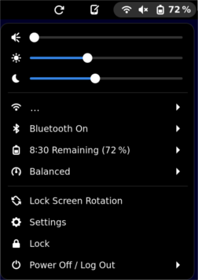

# Gnome Pinenote helper extension

This is a rewrite of pnhelper@m-weigand.github.com that I currently use on my PineNote.
I'm going to submit some merge requests to share these suggestions but will probably continue to use this version for myself.

## Changes

- Added a second brightness slider for the warm backlight to the main gnome panel
- Added a refresh threshold slider to the driver menu
- Changed the buttons to toggles, to be more consistent with the rest of gnome
- Changed the icons to better describe the parameters to control (though I'm still not settled on them)
- Added a third indicator button to force a screen redraw
- Separated UI elements from IO and subprocess calls
- Removed the rotate button. This is mainly for myself, because I'm relying on "Lock Screen Rotation" from the main panel + the acceleration sensors, to rotate. In my opinion, the rotate button is obsolete




### TODO

I also intend to 

- rename the waveforms to use laymen's terms (maybe `fast`, `normal`, `quality` or similar),
- highlight the currently used default waveform,
- port refresh_screen to javascript (if possible), and
- maybe work on a D-Bus service that sends update messages, to display the current parameters even when another process changes them.

## Installation

* Build and install [refresh_screen](https://gitlab.com/hrdl/pinenote-shared/-/tree/main/helpers/refresh_screen)
* Copy to the local extension directory

	rsync -avh pnhelper@m-weigand.github.com/ $HOME/.local/share/gnome-shell/extensions/pnhelper@m-weigand.github.com/

* enable in gnome extension manager
* restart gnome

### udev Rules

You need to enable write access for some system files, which is best done with udev rules.

```bash
# 30-rockchip-ebc.rules
SUBSYSTEM=="module", KERNEL=="rockchip_ebc", RUN+="/bin/chgrp video /sys/module/%k/parameters/auto_refresh /sys/module/%k/parameters/bw_dither_invert /sys/module/%k/parameters/bw_threshold /sys/module/%k/parameters/bw_mode /sys/module/%k/parameters/diff_mode /sys/module/%k/parameters/direct_mode /sys/module/%k/parameters/limit_fb_blits /sys/module/%k/parameters/panel_reflection /sys/module/%k/parameters/refresh_threshold /sys/module/%k/parameters/refresh_waveform /sys/module/%k/parameters/skip_reset /sys/module/%k/parameters/split_area_limit /sys/module/%k/parameters/default_waveform", RUN+="/bin/chmod g+w /sys/module/%k/parameters/bw_threshold /sys/module/%k/parameters/bw_mode /sys/module/%k/parameters/default_waveform  /sys/module/%k/parameters/diff_mode /sys/module/%k/parameters/direct_mode /sys/module/%k/parameters/limit_fb_blits /sys/module/%k/parameters/panel_reflection /sys/module/%k/parameters/refresh_threshold /sys/module/%k/parameters/refresh_waveform /sys/module/%k/parameters/skip_reset /sys/module/%k/parameters/auto_refresh /sys/module/%k/parameters/bw_dither_invert /sys/module/%k/parameters/split_area_limit"
DRIVER=="rockchip-ebc", RUN+="/bin/chgrp video /sys/%p/power/control", RUN+="/bin/chmod g+w /sys/%p/power/control"
```

The warm backlight needs write access as well: [83-backlight.rules](https://gitlab.com/hrdl/pinenote-shared/-/blob/main/etc/udev/rules.d/83-backlight.rules)

Also ensure that your user is in the video group (as root).

```
usermod -aG video <USERNAME HERE>
```
